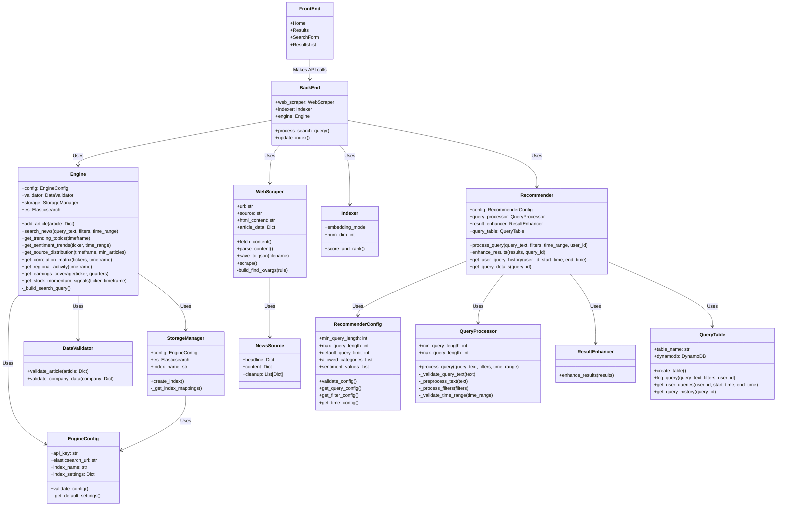
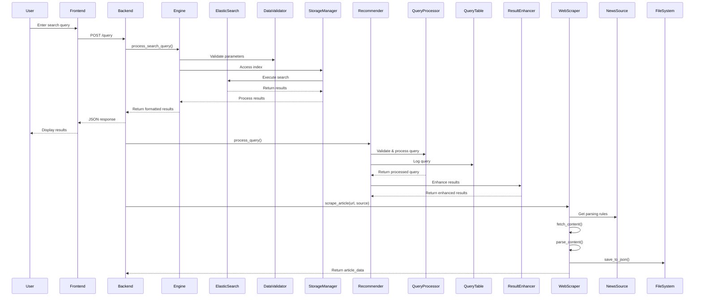

# search-engine
BU ECE Capstone Project: an effective financial search engine

### Project Structure

```
search-engine/
├── README.md
├── ARCHITECTURE.md
├── LICENSE
├── requirements.txt
│
├── models/
│   ├── trained/
│   │   └── embedding_model.pth
│   └── train_embedding_model.py
│
├── backend/
│   ├── __init__.py
│   ├── backend.py
│   ├── scraper/
│   │   ├── __init__.py
│   │   └── WebScraper.py
│   ├── indexer.py
│   ├── elasticsearch/
│   │   ├── __init__.py
│   │   ├── DataValidator.py
│   │   ├── Engine.py
│   │   ├── EngineConfig.py
│   │   └── StorageManager.py
│   └── recommender/
│       ├── __init__.py
│       ├── Recommender.py
│       ├── QueryProcessor.py
│       ├── ResultEnhancer.py
│       ├── QueryTable.py
│       └── RecommenderConfig.py
│
├── frontend/
│   └── ... react stuff ...
│
├── utils/
│   ├── __init__.py
│   └── helpers.py
│
└── main.py

```

### Microservices Diagram


### Data Flow Diagram


### Search Process Diagram

```mermaid
stateDiagram-v2
    [*] --> QueryInput: User enters search
    
    QueryInput --> QueryValidation: Submit query
    
    state QueryValidation {
        [*] --> ValidateParams
        ValidateParams --> BuildQuery
        BuildQuery --> [*]
    }
    
    QueryValidation --> DataRetrieval: Process query
    
    state DataRetrieval {
        [*] --> ElasticsearchSearch
        ElasticsearchSearch --> ApplyFilters
        ApplyFilters --> TimeRangeFilter
        TimeRangeFilter --> [*]
    }
    
    DataRetrieval --> ResultsProcessing: Enrich results
    
    state ResultsProcessing {
        [*] --> RankResults
        RankResults --> ExtractHighlights
        ExtractHighlights --> AggregateMetrics
        AggregateMetrics --> [*]
    }
    
    ResultsProcessing --> Display: Show results
    
    state Display {
        [*] --> RenderList
        RenderList --> ShowPagination
        ShowPagination --> EnableFilters
        EnableFilters --> [*]
    }
    
    Display --> [*]: Display to user

    state QueryProcessing {
        [*] --> ValidateLength
        ValidateLength --> PreprocessText
        PreprocessText --> ProcessFilters
        ProcessFilters --> ValidateTimeRange
        ValidateTimeRange --> [*]
    }

    state ResultEnhancement {
        [*] --> LogQuery
        LogQuery --> EnhanceResults
        EnhanceResults --> UpdateQueryStats
        UpdateQueryStats --> [*]
    }

    QueryValidation --> QueryProcessing
    QueryProcessing --> DataRetrieval
    ResultsProcessing --> ResultEnhancement
    ResultEnhancement --> Display

    state ContentScraping {
        [*] --> FetchHTML
        FetchHTML --> ApplySourceRules
        ApplySourceRules --> ExtractHeadline
        ExtractHeadline --> ExtractContent
        ExtractContent --> CleanupContent
        CleanupContent --> [*]
    }

    DataRetrieval --> ContentScraping: Fetch new content
    ContentScraping --> ResultsProcessing: Process scraped content

```

