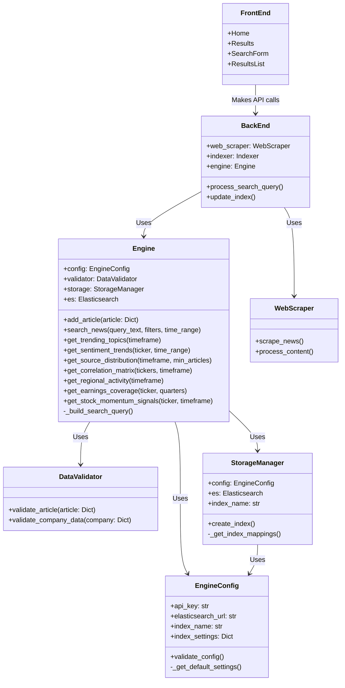
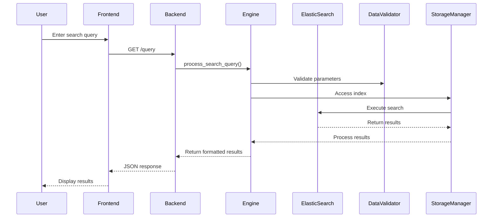

# search-engine
BU ECE Capstone Project: an effective financial search engine

## Project Structure

```
search-engine/
├── backend/
│   ├── api/
│   │   ├── __init__.py
│   │   ├── es_database/
│   │   │   ├── __init__.py
│   │   │   ├── DataValidator.py
│   │   │   ├── Engine.py
│   │   │   ├── EngineConfig.py
│   │   │   ├── StorageManager.py
│   │   │   └── README.md
│   │   ├── scraper/
│   │   │   ├── __init__.py
│   │   │   ├── README.md
│   │   │   ├── scrapers.py
│   │   │   ├── run_scrapers.py
│   │   │   ├── data/
│   │   │   └── articles/
│   │   ├── backend-scripts/
│   │   │   ├── before_install.sh
│   │   │   └── deploy.sh
│   │   ├── utils/
│   │   ├── .env
│   │   ├── .env.test
│   │   ├── __init__.py
│   │   ├── appspec.yml
│   │   ├── backend.py
│   │   ├── check_es_connection.py
│   │   ├── CI_TEST_README.md
│   │   ├── conftest.py
│   │   ├── elasticsearch_test.py
│   │   ├── pytest.ini
│   │   ├── README.md
│   │   ├── requirements.txt
│   │   ├── reset_and_scrape.py
│   │   ├── update_all_processed_urls.py
│   │   ├── update_es_database.py
│   │   └── update_processed_urls.py
│   ├── buildspecs/
│   │   ├── api-deploy/
│   │   │   ├── api-scripts/
│   │   │   │   ├── deploy.sh
│   │   │   │   ├── extract_app.py
│   │   │   │   ├── create_env_file.sh
│   │   │   │   ├── lifecycle_handler.sh
│   │   │   │   ├── financial-news.service
│   │   │   │   └── verify.sh
│   │   │   ├── api-deploy.yml
│   │   │   ├── backend-build.yml
│   │   │   ├── backend-deploy.yml
│   │   │   ├── deployment-notification.yml
│   │   │   ├── frontend-build.yml
│   │   │   ├── frontend-deploy.yml
│   │   │   └── README.md
│   ├── frontend/
│   │   ├── public/
│   │   ├── src/
│   │   │   ├── components/
│   │   │   │   ├── AnalyticsSideMenu.css
│   │   │   │   ├── AnalyticsSideMenu.js
│   │   │   │   ├── Article.js
│   │   │   │   ├── Filters.js
│   │   │   │   ├── Home.js
│   │   │   │   ├── Results.js
│   │   │   │   └── unused/
│   │   │   ├── constants/
│   │   │   │   └── index.js
│   │   │   ├── services/
│   │   │   │   └── api.js
│   │   │   ├── styles/
│   │   │   │   ├── Results.css
│   │   │   │   └── SideMenu.css
│   │   │   ├── App.css
│   │   │   ├── App.js
│   │   │   ├── App.test.js
│   │   │   ├── index.css
│   │   │   ├── index.js
│   │   │   └── setupTests.js
│   │   ├── .env.development
│   │   ├── .env.production
│   │   ├── appspec.yml
│   │   ├── jest.config.js
│   │   ├── package-lock.json
│   │   ├── package.json
│   │   └── README.md
│   ├── deployment-scripts/
│   │   ├── after_install.sh
│   │   ├── before_install.sh
│   │   ├── cleanup.sh
│   │   ├── create_env_file.sh
│   │   ├── lifecycle_handler.sh
│   │   └── verify_es.sh
│   ├── .env
│   ├── .env.example
│   ├── ARCHITECTURE.md
│   ├── appspec.yml
│   ├── backend-api.yaml
│   ├── backend-buildspec.yml
│   ├── backend-template.yaml
│   ├── buildspec.yml
│   ├── cicd-template.yaml
│   ├── deployspec.yml
│   ├── frontend-deploy.yml
│   ├── frontend-template.yaml
│   ├── LICENSE
│   ├── README.md
│   ├── start.sh
│   ├── stop.sh
│   └── vpc-template.yaml
```

## Cloud Structure (EC2 Instance)

The deployment creates the following structure on EC2 instances:

```
/
├── etc/
│   └── systemd/
│       └── system/
│           └── financial-news.service     # Systemd service definition
├── opt/
│   └── financial-news-engine/             # Main application directory
│       ├── app.py                         # Main application file
│       ├── .env                           # Environment configuration
│       ├── requirements.txt               # Python dependencies
│       ├── deploy_scripts/                # Deployment scripts
│       │   ├── create_env_file.sh         # Script to fetch parameters
│       │   └── lifecycle_handler.sh       # ASG lifecycle management script
│       └── logs/                          # Application logs
│           ├── backend.log                # Application logs
│           ├── service-output.log         # Service standard output
│           └── service-error.log          # Service error output
├── var/
│   ├── log/
│   │   └── asg-lifecycle.log              # Lifecycle hook logs
│   └── run/
│       └── financial-news-lifecycle-hook-state  # Lifecycle state file
└── tmp/                                   # Temporary files
    ├── api-deploy/                        # Deployment staging
    │   └── api-scripts/                   # API deployment scripts staging
    ├── backend.zip                        # Application archive
    └── backend-api.yaml                   # API configuration
```

## Deployment Workflow

1. CI/CD pipeline triggers on git push
2. Code is built and packaged in CodeBuild
3. CloudFormation deploys infrastructure if needed
4. Application code is deployed to EC2 instances via one of two paths:
   - **Direct SSM Deployment**: Uses AWS SSM Run Command to deploy app code directly to instances
   - **Instance Refresh**: Uploads config to S3 and triggers an ASG instance refresh
5. Configuration parameters are retrieved from SSM Parameter Store with fallback options:
   - Primary: Using `get-parameters-by-path` to fetch all parameters at once
   - Fallback: Individual parameter retrieval with exponential backoff retry
6. Systemd service is configured and started
7. Application is verified via health checks
8. Auto Scaling Group lifecycle hooks manage graceful application startup and shutdown

## CI/CD Pipeline Components

```
 ┌─────────────┐     ┌───────────────┐     ┌──────────────────┐
 │ Source Code │────▶│ CodePipeline  │────▶│ Build & Test     │
 │ (GitHub)    │     │               │     │ (CodeBuild)      │
 └─────────────┘     └───────────────┘     └──────────────────┘
                                                    │
                                                    ▼
 ┌─────────────┐     ┌───────────────┐     ┌──────────────────┐
 │ Deployment  │◀────│ SSM Parameter │◀────│ API & Frontend   │
 │ Notification│     │ Store         │     │ Deployment       │
 │ (SNS)       │     │               │     │ (CodeBuild)      │
 └─────────────┘     └───────────────┘     └──────────────────┘
                             ▲                      │
                             │                      ▼
                      ┌──────┴───────┐     ┌──────────────────┐
                      │ EC2 Instances│◀────│ ASG Instance     │
                      │ with App Code│     │ Refresh          │
                      └──────────────┘     └──────────────────┘
```

## Parameter Store Structure

Parameters are stored in AWS Systems Manager Parameter Store under this hierarchy:

```
/financial-news/
├── elasticsearch/
│   ├── endpoint
│   ├── api_key
│   ├── index
│   ├── shards
│   └── replicas
└── environment
```

These parameters are fetched using a robust retrieval strategy:
1. First attempt: `get-parameters-by-path` API call to fetch all parameters at once
2. Fallback: Individual parameter retrieval with exponential backoff retry
3. Default values: If parameter retrieval fails, predefined defaults are used

## Auto Scaling Group Lifecycle Management

The application implements lifecycle hooks for graceful handling of EC2 instance events:

1. **Instance Launch**: 
   - Registers with load balancer
   - Verifies application deployment
   - Starts the application service

2. **Instance Termination**:
   - Gracefully stops the application service
   - Performs cleanup operations
   - Signals completion to Auto Scaling Group

This ensures zero-downtime deployments and proper application lifecycle management.

## Microservices Diagram


## Data Flow Diagram
