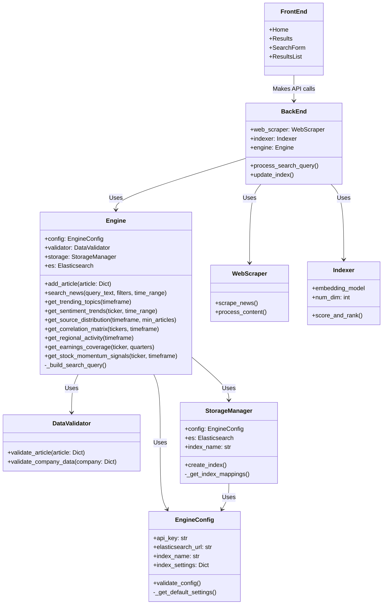
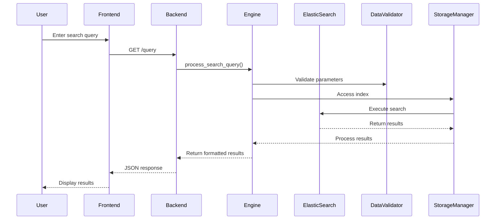

# search-engine
BU ECE Capstone Project: an effective financial search engine

### Project Structure

```
search-engine/
├── README.md
├── ARCHITECTURE.md
├── LICENSE
├── requirements.txt 
├── start.sh
├── stop.sh
│
├── backend/
│   ├── __init__.py
│   ├── backend.py
│   ├── update_database.py
│   ├── elasticsearch_test.py
│   │
│   ├── scraper/
│   │   ├── __init__.py
│   │   ├── README.md
│   │   ├── web_scraper.py
│   │   ├── ap_news_scraper.py
│   │   ├── RSS_scraper.py
│   │   └── articles/
│   │       ├── bbc_articles.json
│   │       └── npr_articles.json
│   │
│   ├── indexer/
│   │   ├── __init__.py
│   │   └── indexer.py
│   │
│   └── es_database/
│       ├── __init__.py
│       ├── DataValidator.py
│       ├── Engine.py
│       ├── EngineConfig.py
│       └── StorageManager.py
│
├── frontend/
│   ├── public/
│   │   ├── index.html
│   │   ├── manifest.json
│   │   └── robots.txt
│   │
│   ├── src/
│   │   ├── components/
│   │   │   ├── Home.js
│   │   │   ├── Results.js
│   │   │   └── unused/
│   │   │
│   │   ├── styles/
│   │   │   ├── App.css
│   │   │   ├── Home.css
│   │   │   └── index.css
│   │   │
│   │   ├── App.js
│   │   └── index.js
│   │
│   ├── package.json
│   └── README.md
│
└── utils/
    └── __init__.py

```

### Microservices Diagram


### Data Flow Diagram
