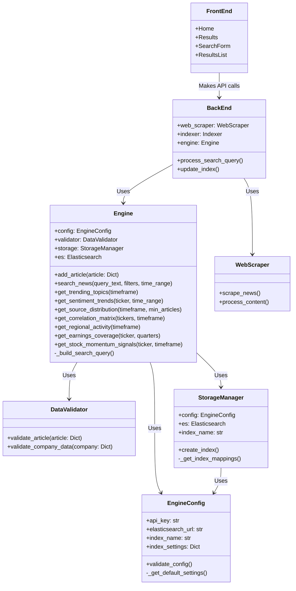
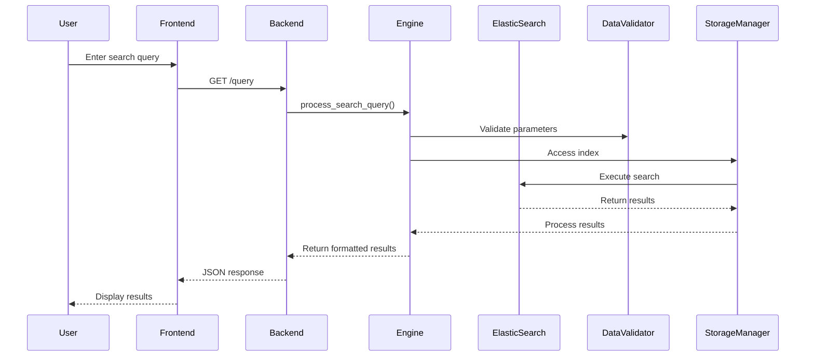

# search-engine
BU ECE Capstone Project: an effective financial search engine

## Project Structure

```
search-engine/
├── backend/
│   ├── api/
│   ├── es_database/
│   │   ├── __init__.py
│   │   ├── DataValidator.py
│   │   ├── Engine.py
│   │   ├── EngineConfig.py
│   │   ├── StorageManager.py
│   │   └── README.md
│   ├── scraper/
│   │   ├── __init__.py
│   │   ├── README.md
│   │   ├── scrapers.py
│   │   ├── run_scrapers.py
│   │   ├── data/
│   │   └── articles/
│   ├── scripts/
│   │   ├── before_install.sh
│   │   └── deploy.sh
│   ├── utils/
│   ├── .env
│   ├── .env.test
│   ├── __init__.py
│   ├── appspec.yml
│   ├── backend.py
│   ├── check_es_connection.py
│   ├── CI_TEST_README.md
│   ├── conftest.py
│   ├── elasticsearch_test.py
│   ├── pytest.ini
│   ├── README.md
│   ├── requirements.txt
│   ├── reset_and_scrape.py
│   ├── update_all_processed_urls.py
│   ├── update_es_database.py
│   └── update_processed_urls.py
├── buildspecs/
│   ├── api-deploy/
│   │   ├── scripts/
│   │   │   ├── deploy.sh
│   │   │   ├── extract_app.py
│   │   │   ├── financial-news.service
│   │   │   └── verify.sh
│   ├── api-deploy.yml
│   ├── backend-build.yml
│   ├── backend-deploy.yml
│   ├── deployment-notification.yml
│   ├── frontend-build.yml
│   ├── frontend-deploy.yml
│   └── README.md
├── frontend/
│   ├── public/
│   ├── src/
│   │   ├── components/
│   │   ├── services/
│   │   ├── styles/
│   │   ├── App.css
│   │   ├── App.js
│   │   ├── App.test.js
│   │   ├── index.css
│   │   ├── index.js
│   │   └── setupTests.js
│   ├── .env.development
│   ├── .env.production
│   ├── appspec.yml
│   ├── jest.config.js
│   ├── package-lock.json
│   ├── package.json
│   └── README.md
├── scripts/
│   ├── after_install.sh
│   ├── before_install.sh
│   ├── cleanup.sh
│   ├── create_env_file.sh
│   └── verify_es.sh
├── .env
├── .env.example
├── ARCHITECTURE.md
├── appspec.yml
├── backend-api.yaml
├── backend-buildspec.yml
├── backend-template.yaml
├── buildspec.yml
├── cicd-template.yaml
├── deployspec.yml
├── frontend-deploy.yml
├── frontend-template.yaml
├── LICENSE
├── README.md
├── start.sh
├── stop.sh
└── vpc-template.yaml
```

## Cloud Structure (EC2 Instance)

The deployment creates the following structure on EC2 instances:

```
/
├── etc/
│   └── systemd/
│       └── system/
│           └── financial-news.service     # Systemd service definition
├── opt/
│   └── financial-news-engine/             # Main application directory
│       ├── app.py                         # Main application file
│       ├── .env                           # Environment configuration
│       ├── requirements.txt               # Python dependencies
│       ├── deploy_scripts/                # Deployment scripts
│       │   └── create_env_file.sh         # Script to fetch parameters
│       └── logs/                          # Application logs
│           ├── backend.log                # Application logs
│           ├── service-output.log         # Service standard output
│           └── service-error.log          # Service error output
└── tmp/                                   # Temporary files
    ├── api-deploy/                        # Deployment staging
    ├── backend.zip                        # Application archive
    └── backend-api.yaml                   # API configuration
```

## Deployment Workflow

1. CI/CD pipeline triggers on git push
2. Code is built and packaged in CodeBuild
3. CloudFormation deploys infrastructure if needed
4. Application code is deployed to EC2 instances via SSM or CodeDeploy
5. Configuration parameters are retrieved from SSM Parameter Store
6. Systemd service is configured and started
7. Application is verified via health checks

## Parameter Store Structure

Parameters are stored in AWS Systems Manager Parameter Store under this hierarchy:

```
/financial-news/
├── elasticsearch-url
├── elasticsearch-api-key
├── elasticsearch-index
├── es-number-of-shards
├── es-number-of-replicas
└── environment
```

These parameters are fetched using the `get-parameters-by-path` API call with fallback to individual parameter retrieval.

## Microservices Diagram


## Data Flow Diagram
