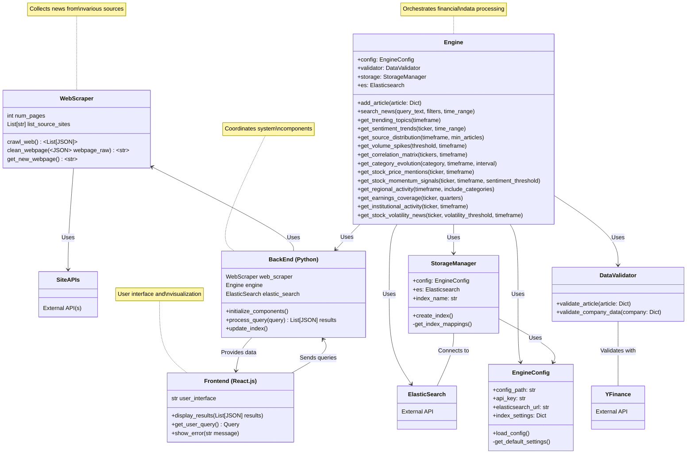

# search-engine
BU ECE Capstone Project: an effective financial search engine

### Project Structure

```
search-engine/
├── README.md
├── LICENSE
├── requirements.txt
├── models/
|    ├── trained/
│    |   └── embedding_model.pth
|    └── train_embedding_model.py
|
├── backend/
│   ├── __init__.py
│   ├── backend.py
│   ├── web_scraper.py
│   ├── indexer.py
│   └── elasticsearch/
│       ├── DataValidator.py
│       ├── Engine.py
│       |── EngineConfig.py
|       └── StorageManager.py  
|
├── frontend/
│   └── ... react stuff ...
|
├── utils/
│   ├── __init__.py
│   └── helpers.py
└── main.py

```


### API Flowchart/Diagram

